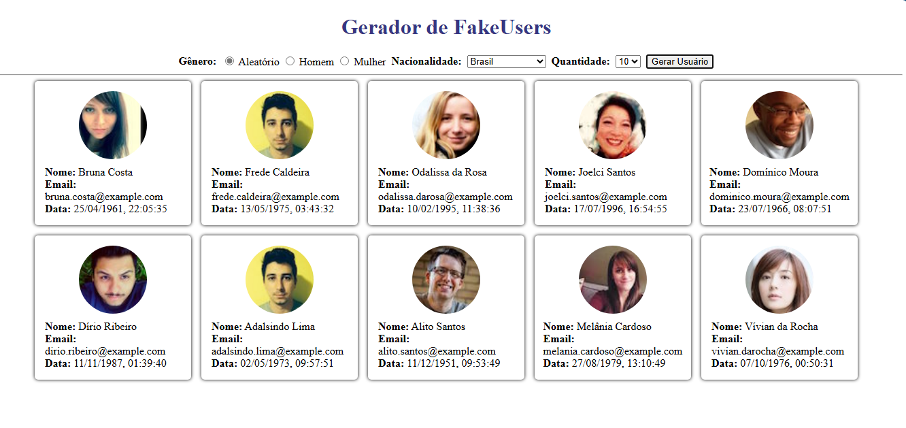

# Projeto Gerador de fakerUser

O projeto consite em usar um API pública para geração de usuário fictícos com informações como nome, email, imagem, estado, país, entre outras

## Design do projeto

## API Utilizada

## Funcionalidades